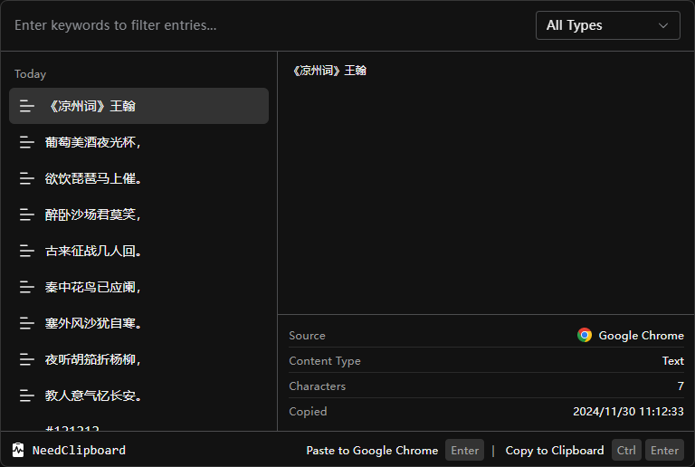

# NeedClipboard

A clipboard app for windows. UI refers to Clipboard in Raycast. Keyboard-first is also supported, it can be operated without using the mouse.




## Shortcut Keys

| Keys                        | Usage                             |
| :-------------------------- | :-------------------------------- |
| `/`                         | Focus the search input            |
| `Tab`                       | Open the menu                     |
| `Ctrl` + `P`                | Expand the type filter            |
| `Up` or `Ctrl` + `J`        | Select up                         |
| `Down` or `Ctrl` + `K`      | Select down                       |
| `Delete` or `Ctrl` + `D`    | Delete the record                 |
| `Ctrl` + `,`                | Open the setting panel            |
| `Enter` or `Ctrl` + `Enter` | Copy to clipboard or Paste to app |
| `Esc`                       | Close app                         |

## Use FAQ

If the `source` attribute of record is not exist, please try running as an administrator.

## Development

First, need execute this script to pre-build native module dependencies.

```shell
yarn install:native
```

Then, install the dependency.

```shell
yarn
```

Last, start project.

```shell
yarn dev
```
